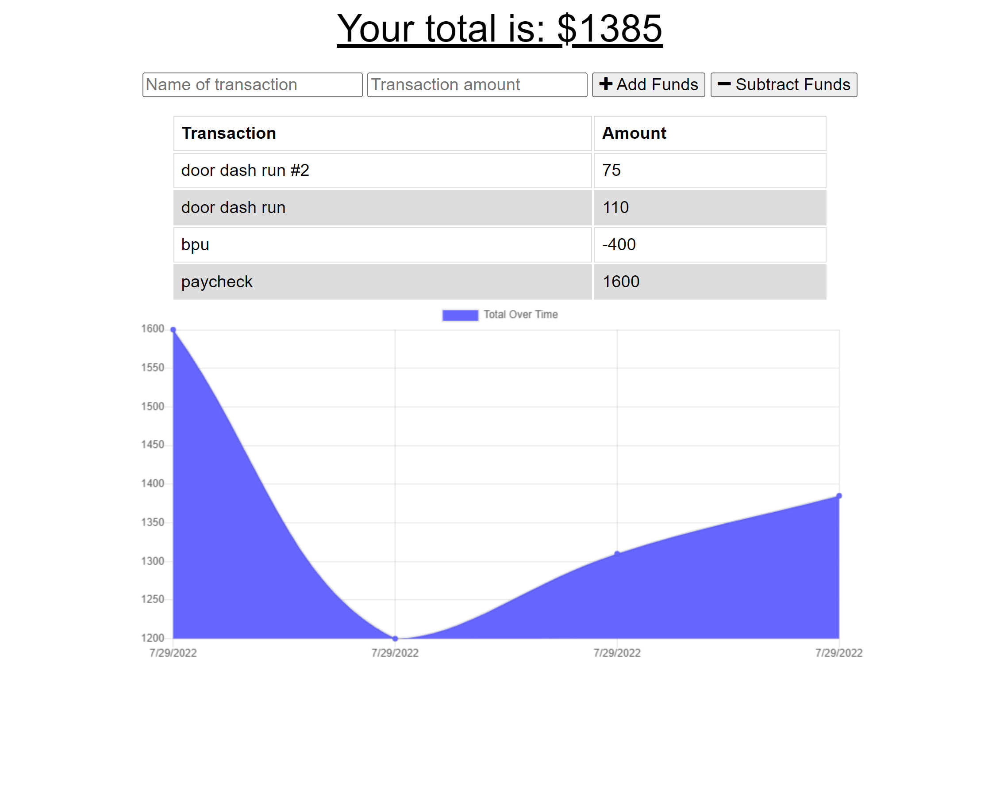

# Budget Tracker

## Description

This app allows someone to track their withdrawals and deposists with or without a data/internet connection so that they can keep track of their account balances while traveling. It's a functioning PWA that also notes inputs of their transactions and submits them to the database once data/internet connection has been reestablished.

## Installation

You can clone this repository and install dependencies, then run 'npm start' from your terminal to start your localhost. This has also been deployed to heroku at [this link](https://secure-sierra-42105.herokuapp.com/).

## Usage

## License

## Questions

If you have any questions related to this project, feel free to reference my [GitHub](github.com/jaguilar95) or send an [email](josue.aguilar1995+bootcamp@gmail.com)
